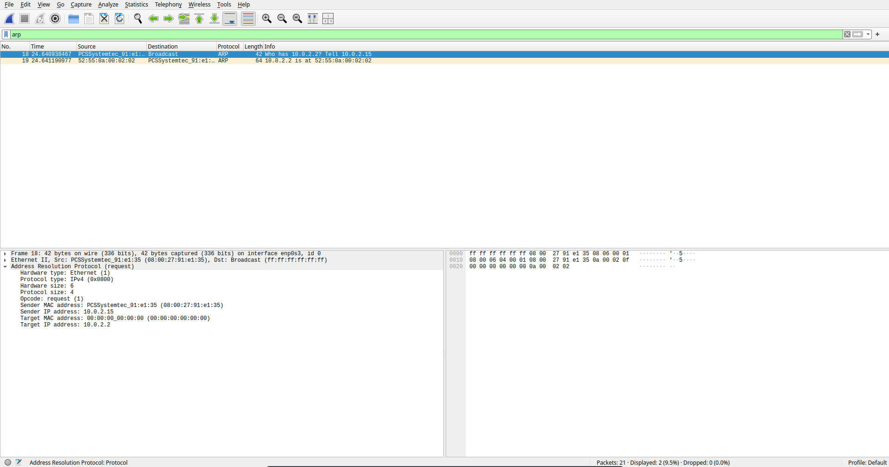
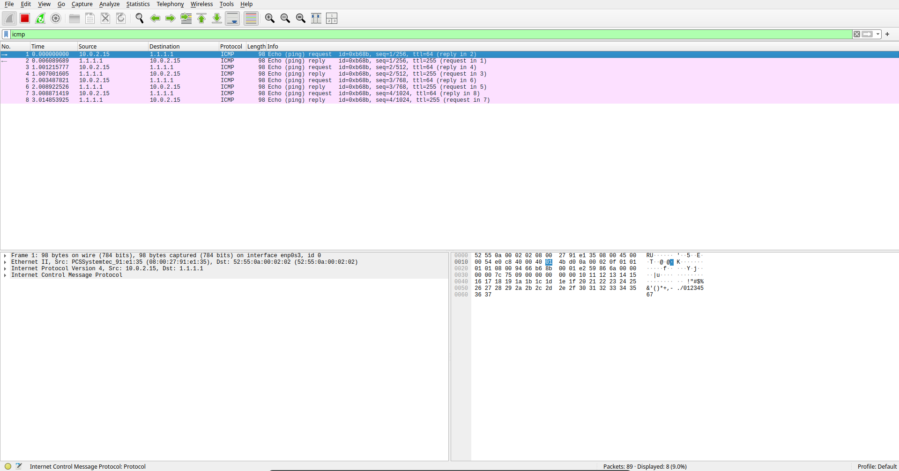
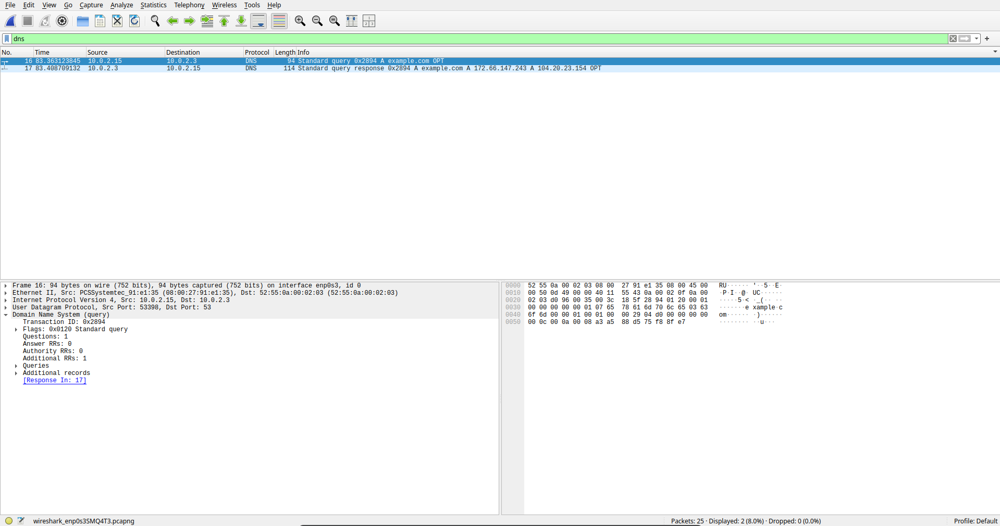
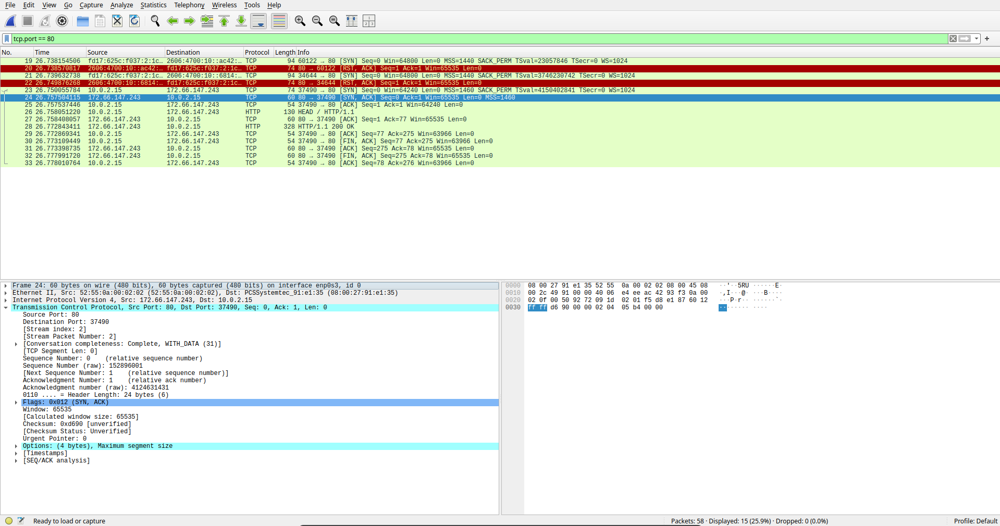

# Lab 01: Core Protocol Analysis (ARP, ICMP, DNS, TCP)

## Overview
For this lab, I captured and analyzed traffic for four foundational protocols — ARP, ICMP, DNS, and TCP — using Wireshark on a Parrot Security OS VM. The goal was to see how address resolution, basic diagnostics, name resolution, and connection setup work at the packet level instead of just reading about them.

## Setup
* **OS:** Parrot Security OS (VirtualBox VM)
* **Tool:** Wireshark
* **Network:** VirtualBox NAT
  * **Host IP:** `10.0.2.15`
  * **Default Gateway:** `10.0.2.2`
  * **DNS Resolver:** `10.0.2.3`

---

## Protocol Analysis

### 1. ARP
* **Pcap:** [`captures/arp_resolution.pcapng`](captures/arp_resolution.pcapng)
* **Layer:** 2/3

ARP maps an IP address to a MAC address on the local network — you can't actually send anything over Ethernet without it.

In Frame 18, `10.0.2.15` broadcasts out to `ff:ff:ff:ff:ff:ff` asking who has `10.0.2.2`. Frame 19 is the gateway replying directly with its MAC, `52:55:0a:00:02:02`. Nothing here is authenticated, which is the whole reason ARP spoofing works — any device on the segment can claim to be any IP and nothing checks it.

---

### 2. ICMP
* **Pcap:** [`captures/icmp_ping.pcapng`](captures/icmp_ping.pcapng)
* **Layer:** 3

Pinging `1.1.1.1` (Cloudflare) generates a straightforward Echo Request / Echo Reply pair — Type 8 out, Type 0 back, TTL 64 on the request.

Wireshark ties the request and reply together using the sequence number (`seq=1/256`) and identifier (`id=0xb68b`), which is how it knows which reply belongs to which request when multiple pings are in flight.

---

### 3. DNS
* **Pcap:** [`captures/dns_query.pcapng`](captures/dns_query.pcapng)
* **Layer:** 7 (over UDP/53)

Frame 16 is the query — `10.0.2.15` asks the resolver at `10.0.2.3` for the A record of `example.com`, transaction ID `0x2894`.

The resolver comes back in Frame 17 with two A records: `172.66.147.243` and `104.20.23.154`.

**Security Insight:** This whole exchange is plaintext. Anyone sniffing the link can see exactly which domains are being looked up unless it's wrapped in DoH or DoT.

---

### 4. TCP 3-Way Handshake
* **Pcap:** [`captures/tcp_3way_handshake.pcapng`](captures/tcp_3way_handshake.pcapng)
* **Layer:** 4

This is the setup that has to happen before any real data moves:

* **SYN (Frame 23):** Client `10.0.2.15:37490` reaches out to `172.66.147.243:80`, `Seq = 0`.
* **SYN-ACK (Frame 24):** Server responds, `Seq = 0`, `Ack = 1`.
* **ACK (Frame 25):** Client finishes with `Seq = 1`, `Ack = 1`. Connection's up, and the HTTP `HEAD /` request goes out right after.

---

## Summary Matrix

| Protocol | Layer | Transport | Addressing | Function |
| :--- | :--- | :--- | :--- | :--- |
| **ARP** | 2/3 | Ethernet | IP $\rightarrow$ MAC | Resolves IPv4 to MAC address |
| **ICMP** | 3 | IP | Src/Dst IP | Connectivity & diagnostics |
| **DNS** | 7 | UDP/53 | Domain $\rightarrow$ IP | Hostname resolution |
| **TCP** | 4 | IP Proto 6 | Src/Dst Port | Reliable ordered delivery |
